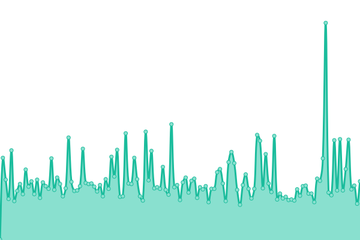
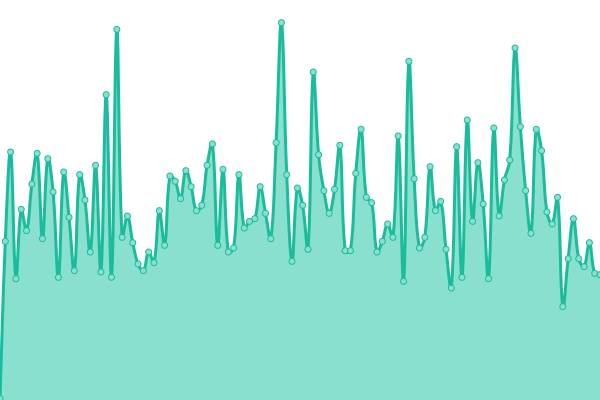
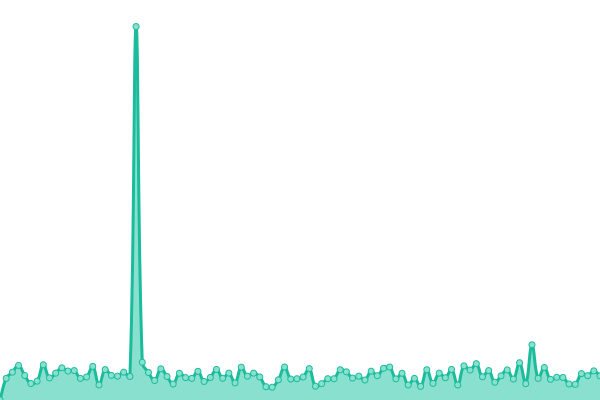
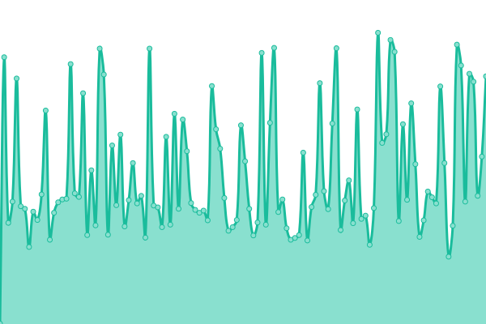
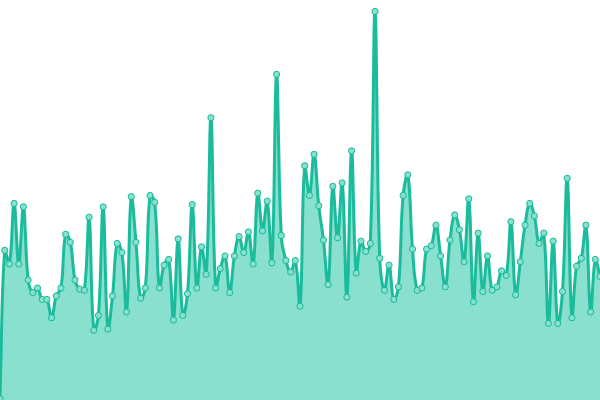
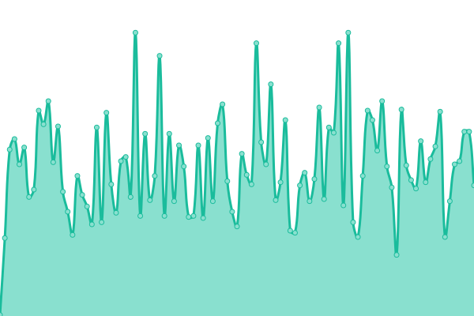

# [📈 Live Status](https://status.dis.dev): <!--live status--> **🟧 Partial outage**

This repository contains the open-source uptime monitor and status page for [Upptime](https://upptime.js.org), powered by [Upptime](https://github.com/upptime/upptime).

With [Upptime](https://upptime.js.org), you can get your own unlimited and free uptime monitor and status page, powered entirely by a GitHub repository. We use [Issues](https://github.com/upptime/upptime/issues) as incident reports, [Actions](https://github.com/quacks-yaks/up/actions) as uptime monitors, and [Pages](https://status.dis.dev) for the status page.

<!--start: status pages-->
<!-- This summary is generated by Upptime (https://github.com/upptime/upptime) -->
<!-- Do not edit this manually, your changes will be overwritten -->
<!-- prettier-ignore -->
| URL | Status | History | Response Time | Uptime |
| --- | ------ | ------- | ------------- | ------ |
|  [Google](https://www.google.com) | 🟩 Up | [google.yml](https://github.com/quacks-yaks/up/commits/HEAD/history/google.yml) | 

 253ms
     
 | 

<a href="https://status.dis.dev/history/google">99.77%</a>
    

|  [Jelly](https://jelly.dis.dev) | 🟥 Down | [jelly.yml](https://github.com/quacks-yaks/up/commits/HEAD/history/jelly.yml) | 

 187ms
     
 | 

<a href="https://status.dis.dev/history/jelly">0.00%</a>
    

|  [Trans](https://trans.dis.dev) | 🟥 Down | [trans.yml](https://github.com/quacks-yaks/up/commits/HEAD/history/trans.yml) | 

 155ms
     
 | 

<a href="https://status.dis.dev/history/trans">0.00%</a>
    

|  [Pikvm](https://pikvm.dis.dev) | 🟩 Up | [pikvm.yml](https://github.com/quacks-yaks/up/commits/HEAD/history/pikvm.yml) | 

 512ms
     
 | 

<a href="https://status.dis.dev/history/pikvm">100.00%</a>
    

|  [Time](https://time.dis.dev) | 🟥 Down | [time.yml](https://github.com/quacks-yaks/up/commits/HEAD/history/time.yml) | 

 231ms
     
 | 

<a href="https://status.dis.dev/history/time">0.00%</a>
    

|  [Files](https://files.dis.dev) | 🟥 Down | [files.yml](https://github.com/quacks-yaks/up/commits/HEAD/history/files.yml) | 

 147ms
     
 | 

<a href="https://status.dis.dev/history/files">0.00%</a>
    

<!--end: status pages-->

[**Visit our status website →**](https://status.dis.dev)

## 📄 License

- Powered by: [Upptime](https://github.com/upptime/upptime)
- Code: [MIT](./LICENSE) © [Upptime](https://upptime.js.org)
- Data in the `./history` directory: [Open Database License](https://opendatacommons.org/licenses/odbl/1-0/)
